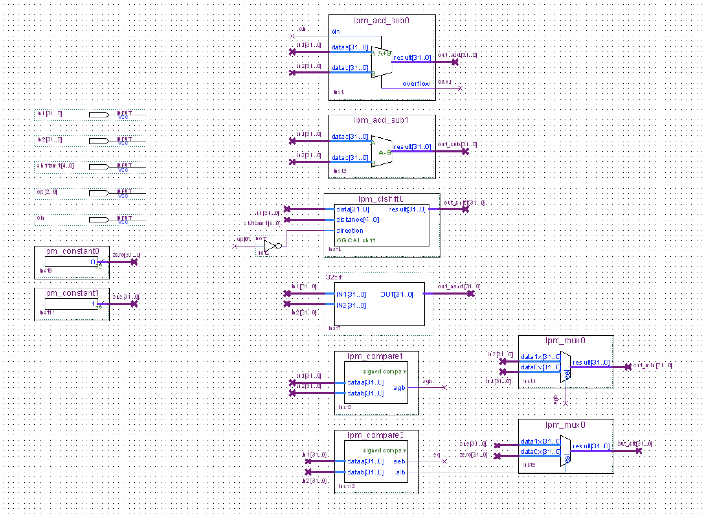
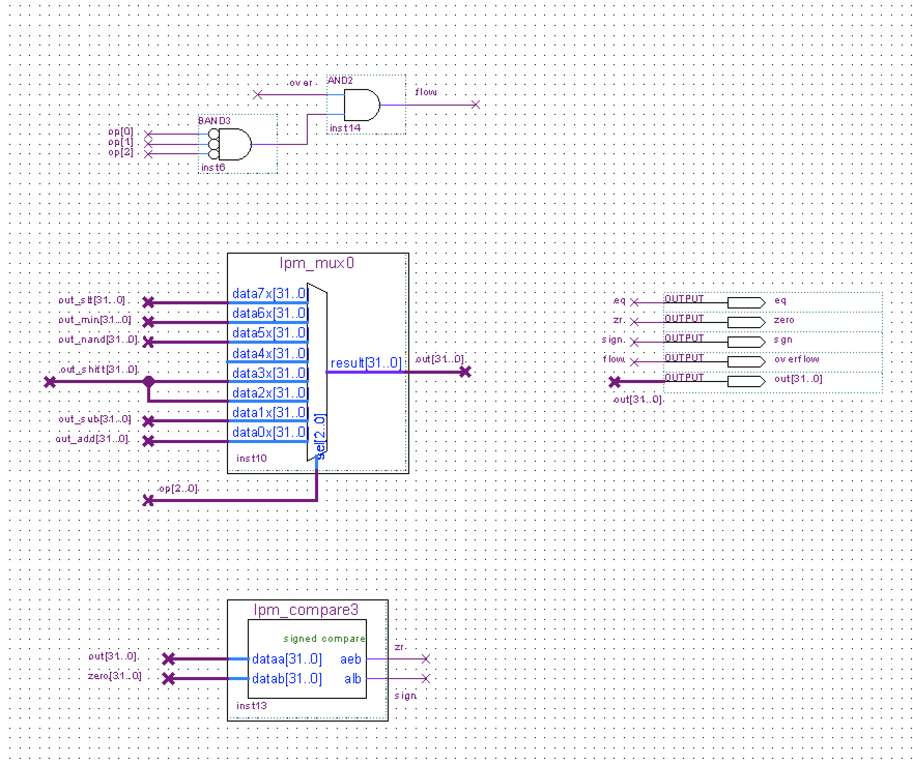
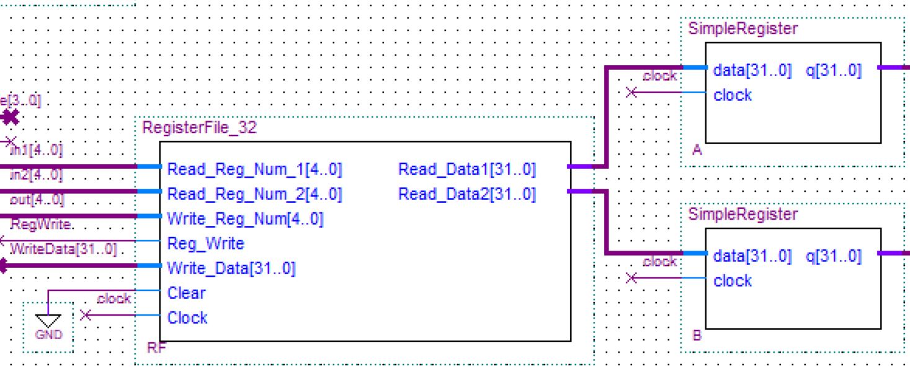

# Custom Multicycle DataPath Design 

Custom Multicycle DataPath Design on Quartus II 13.0sp1.

The multicycle microarchitecture is based on Dr.Asadi's **Computer Architecture** slides.

Sharif University of Technology

Computer Engineering Department

## Contributors

1. [Ahmad Salimi](https://github.com/ahmadsalimi)
2. [Hamila Mailee](https://github.com/hamilamailee)
3. [Saber Zafarpoor](https://github.com/SaberDoTcodeR)

# Hierarchical Design

## High-Level Abstraction of Datapath

This is the Highest Level Abstraction of our design. We have several components that will be explained.

## Datapath Modules
- **PC**: A 32-bit register that stores current Program Counter.
- **Memory**: A ROM with 20-bit words for storing instructions.
- **IR**: A 20-bit register that stores currently executing instruction and decodes each part of the instruction (`opcode`, `cin`, `in1`, `in2`, `out`).
- **Control**: A Finite State Machine that adjusts control signals, such as `IRWrite`, `PCWrite`, `RegWrite` `ALUSrcA`, `ALUSrcB`, `ALUOp`, and `Li` according to `Opcode` and previous state. We have used `1100` opcode for `No-Op` instruction.

Instruction Execution Stages according to instruction type is as shown below:

    |  Cycle |   1   |   2   |  3  |  4 |
    |:------:|:-----:|:-----:|:---:|:--:|
    | R-type | IF-PC | ID-RF | ALU | WB |
    |   Li   | IF-PC |   ID  |  WB |    |
    |  No-Op | IF-PC |   ID  |     |    |

    So, the FSM diagram is as shown below.

    

    - Control signals of `R-type` instructions:

        | Cycle | IRWrite | PCWrite | RegWrite | ALUSrcA | ALUSrcB |     ALUOp    | Li |
        |:-----:|:-------:|:-------:|:--------:|:-------:|:-------:|:------------:|:--:|
        | IF-PC |    1    |    1    |     0    |    1    |    1    |   000 (add)  |  X |
        | ID-RF |    0    |    0    |     0    |    X    |    X    |       X      |  X |
        |  ALU  |    0    |    0    |     0    |    0    |    0    | opcode[2..0] |  X |
        |   WB  |    0    |    0    |     1    |    X    |    X    |       X      |  0 |

    - Control signales of `Li` instruction:

        | Cycle | IRWrite | PCWrite | RegWrite | ALUSrcA | ALUSrcB |   ALUOp   | Li |
        |:-----:|:-------:|:-------:|:--------:|:-------:|:-------:|:---------:|:--:|
        | IF-PC |    1    |    1    |     0    |    1    |    1    | 000 (add) |  X |
        | ID-RF |    0    |    0    |     0    |    X    |    X    |     X     |  X |
        |   WB  |    0    |    0    |     1    |    X    |    X    |     X     |  1 |

    - Control signals of `No-Op` instruction:

        | Cycle | IRWrite | PCWrite | RegWrite | ALUSrcA | ALUSrcB |   ALUOp   | Li |
        |:-----:|:-------:|:-------:|:--------:|:-------:|:-------:|:---------:|:--:|
        | IF-PC |    1    |    1    |     0    |    1    |    1    | 000 (add) |  X |
        | ID-RF |    0    |    0    |     0    |    X    |    X    |     X     |  X |

    So, the control unit was designed by a one-hot method to convert above FSM to the below logical circuit.

    

- **RF**: A Register File that has 32 Registers with a width of 32 bits.
- **Zero Extend**: extends 5-bit input to a 32-bit bus.
- **ALU**: Calculates the needed outputs, based on `op` bits. The handled functions are : `add`,`sub`,`srl`,`sll`,`nand`,`min` and `slt`.
    1. Calculate possible outputs, not considering the `opcode` :
        - `add` -> Full Adder
        - `sub` -> Full Subtractor
        - `srl`,`sll` -> Logical shift unit (shift bits in `shiftamt`). `srl` has opcode of `010` and `sll` has opcode of `011`, so we use the `op[0]` bit (with a not gate) to determine whether it's left shift or right shift.
        - `nand` -> A bit by bit nand gate for 32-bit inputs.
        - `min` -> Returns the smaller input using a compare unit and a multiplexer.
        - `slt` -> Returns 1 if `in1 < in2` and 0 if `in1 >= in2`.

        

    1. Choose the right ouput based on `opcode`:
        - `overflow` -> Is set to 1 only if the instruction is `add` and the overflow happens.
        - `eq` -> Is set to 1 when the two inputs of ALU are equal.
        - `zero` -> Is set to 1 when the final output of the ALU is zero.
        - `sgn` -> Is set to 1 when the final output is smaller than zero.
        - `output` -> The final 32-bit output will be chosen based on the opcode using a multiplexer.

        

## Execution Stages
     
- Instruction Fetch, PC assignment:
    - `IR <- Mem[PC]`
    - `PC <- PC + 1`

    

- Instruction Decode, Register File:
    - `A <- GPR[in1]`
    - `B <- GPR[in2]`

    

- ALU Execution
    Two Multiplexers choose inputs of ALU, and the select signals are given by **Control Unit**. The 1<sup>st</sup> input can be `A` register or `PC`, and the 2<sup>nd</sup> input can be `B` register of 1. Then, ALU executes the instruction. **Control unit** specifies type of operation with ALUOp.

    

- Write Back:

    `Li` signal from **Control unit** chooses `AluOut` or zero-extended `shiftamt` value, and write that in RF.

    

## Runnig A Program

1. Write an assembly program with `MIPS` syntax.
    
    The program below contains all supported instructions of our processor.

    ```mips
    li      $0, 10
    li      $1, 4
    add     $2, $1, $0, 1   # $2 = $1 + $0 + 1 = 15 (all alu signals = 0)
    sub     $3, $2, $1		# $3 = $2 - $1 = 10 (all alu signals = 0)
    slt     $4, $3, $2      # $4 = $3 < $2 = 1 (all alu signals = 0)
    noop
    sll     $5, $4, 3       # $5 = $4 << 3 = 8 (all alu signals = 0)
    srl     $6, $5, 2       # $6 = $5 >> 2 = 2 (all alu signals = 0)
    nand    $7, $5, $6      # $7 = $5 nand $6 = -1 (sgn = 1)
    min     $8, $6, $7      # $8 = min($6, $7) = -1 (sgn = 1)
    sll     $9, $4, 30      # $9 = 1 << 30 = 2 ^ 30 (all alu signals = 0)
    add     $10, $9, $9     # $10 = $9 + $9 = - 2 ^ 31 (overflow, eq, sgn = 1)
    sub     $11, $9, $9     # $11 = 0 (eq, zero = 1)
    ```

2. Convert the assembly to a `.mif` file.

    We have implemented an assembler program that translates given `MIPS` assembly code to a `.mif` format file. The assembler is written by `c#` language. you can download the **portable** executable form of assembler from [here](https://github.com/ahmadsalimi/MultiCycle/releases). after downloading it, you can assemble your `MIPS` code by below command in command-line of your os.

    - Windows **CMD** or **Powershell**:
    ```bash
    .\Assembler-win-64.exe source.asm target.mif
    ```

    - Linux **Terminal**:
    ```bash
    ./Assembler-linux-64 source.asm target.mif
    ```

    - MacOS **Terminal**:
    ```bash
    ./Assembler-osx-64 source.asm target.mif
    ```

    The result file of above assembly code will be:

    ```
    DEPTH = 65536;
    WIDTH = 20;
    ADDRESS_RADIX = HEX;
    DATA_RADIX = BIN;
    CONTENT
    BEGIN
    0 : 10000000000101000000;
    1 : 10000000000010000001;
    2 : 00001000010000000010;
    3 : 00010000100000100011;
    4 : 01110000110001000100;
    5 : 11000000000000000000;
    6 : 00110001000001100101;
    7 : 00100001010001000110;
    8 : 01010001010011000111;
    9 : 01100001100011101000;
    A : 00110001001111001001;
    B : 00000010010100101010;
    C : 00010010010100101011;
    END;
    ```

    Then save result file as `src/Memory/InitialMemory.mif`.

3. Run `src/Waveform.vwf` by **Quartus Cyclone II**. The result will be as shown below:

