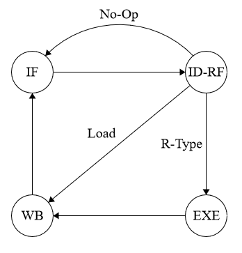
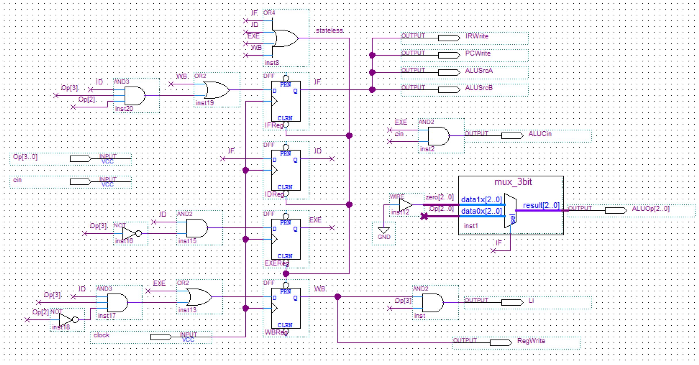
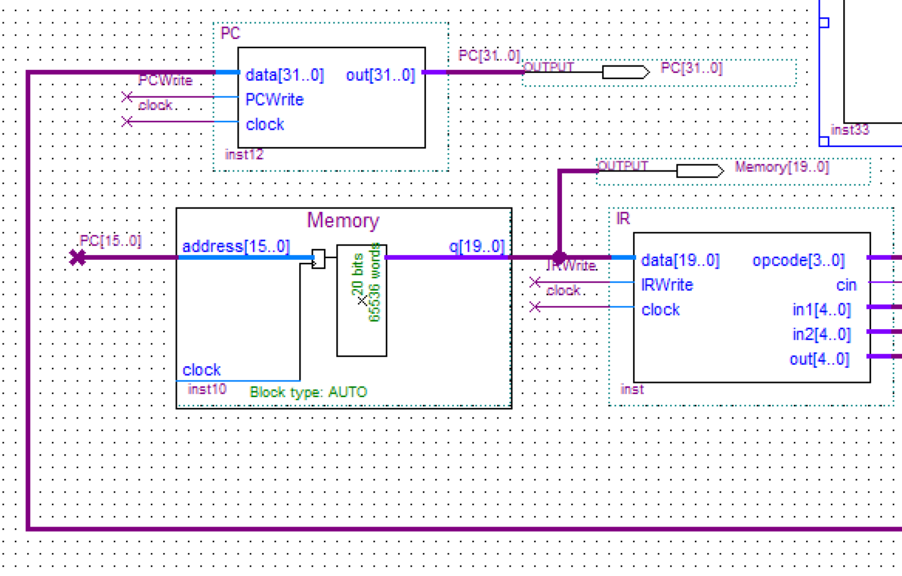
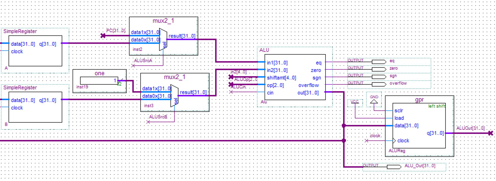
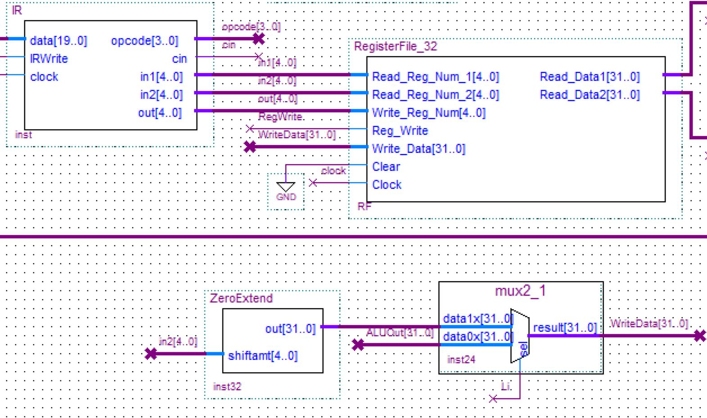

# Custom Multicycle DataPath Design 

Custom Multicycle DataPath Design on Quartus II 13.0sp1.

The multicycle microarchitecture is based on Dr.Asadi's *Computer Architecture* slides.

## Contributors

1. [Ahmad Salimi](https://github.com/ahmadsalimi)
2. [Hamila Mailee](https://github.com/hamilamailee)
3. [Saber Zafarpoor](https://github.com/SaberDoTcodeR)

## Hierarchical Design

### High-Level Abstraction

This is the Highest Level Abstraction of our design. We have several components that will be explained.

#### Datapath modules:
- **PC**: A 32-bit register that stores current Program Counter.
- **Memory**: A ROM with 20-bit words for storing instructions.
- **IR**: A 20-bit register that stores currently executing instruction and decodes each part of the instruction (`opcode`, `cin`, `in1`, `in2`, `out`).
- **Control**: A Finite State Machine that adjusts control signals, such as `IRWrite`, `PCWrite`, `RegWrite` `ALUSrcA`, `ALUSrcB`, `ALUOp`, and `Li` according to `Opcode` and previous state. Instruction Execution Stages according to instruction type is as shown below:

    |  Cycle |   1   |   2   |  3  |  4 |
    |:------:|:-----:|:-----:|:---:|:--:|
    | R-type | IF-PC | ID-RF | ALU | WB |
    |   Li   | IF-PC |   ID  |  WB |    |
    |  No-Op | IF-PC |   ID  |     |    |

    So, the FSM diagram is as shown below.

    

    - Control signals of `R-type` instructions:

        | Cycle | IRWrite | PCWrite | RegWrite | ALUSrcA | ALUSrcB |     ALUOp    | Li |
        |:-----:|:-------:|:-------:|:--------:|:-------:|:-------:|:------------:|:--:|
        | IF-PC |    1    |    1    |     0    |    1    |    1    |   000 (add)  |  X |
        | ID-RF |    0    |    0    |     0    |    X    |    X    |       X      |  X |
        |  ALU  |    0    |    0    |     0    |    0    |    0    | opcode[2..0] |  X |
        |   WB  |    0    |    0    |     1    |    X    |    X    |       X      |  0 |

    - Control signales of `Li` instruction:

        | Cycle | IRWrite | PCWrite | RegWrite | ALUSrcA | ALUSrcB |   ALUOp   | Li |
        |:-----:|:-------:|:-------:|:--------:|:-------:|:-------:|:---------:|:--:|
        | IF-PC |    1    |    1    |     0    |    1    |    1    | 000 (add) |  X |
        | ID-RF |    0    |    0    |     0    |    X    |    X    |     X     |  X |
        |   WB  |    0    |    0    |     1    |    X    |    X    |     X     |  1 |

    - Control signals of `No-Op` instruction:

        | Cycle | IRWrite | PCWrite | RegWrite | ALUSrcA | ALUSrcB |   ALUOp   | Li |
        |:-----:|:-------:|:-------:|:--------:|:-------:|:-------:|:---------:|:--:|
        | IF-PC |    1    |    1    |     0    |    1    |    1    | 000 (add) |  X |
        | ID-RF |    0    |    0    |     0    |    X    |    X    |     X     |  X |

    So, the control unit was designed by a one-hot method to convert above FSM to the below logical circuit.

    

- **RF**: A Register File that has 32 Registers with a width of 32 bits.
- **Zero Extend**: extends 5-bit input to a 32-bit bus.
- **ALU**: Calculates the needed outputs, based on `op` bits. The handled functions are : `add`,`sub`,`srl`,`sll`,`nand`,`min` and `slt`.
    1. Calculate possible outputs, not considering the `opcode` :
        - `add` -> Full Adder
        - `sub` -> Full Subtractor
        - `srl`,`sll` -> Logical shift unit (shift bits in `shiftamt`). `srl` has opcode of `010` and `sll` has opcode of `011`, so we use the `op[0]` bit (with a not gate) to determine whether it's left shift or right shift.
        - `nand` -> A bit by bit nand gate for 32-bit inputs.
        - `min` -> Returns the smaller input using a compare unit and a multiplexer.
        - `slt` -> Returns 1 if `in1 < in2` and 0 if `in1 >= in2`.

        

    1. Choose the right ouput based on `opcode`:
        - `overflow` -> Is set to 1 only if the instruction is `add` and the overflow happens.
        - `eq` -> Is set to 1 when the two inputs of ALU are equal.
        - `zero` -> Is set to 1 when the final output of the ALU is zero.
        - `sgn` -> Is set to 1 when the final output is smaller than zero.
        - `output` -> The final 32-bit output will be chosen based on the opcode using a multiplexer.

        
     
- Instruction Fetch, PC assignment:
    - `IR <- Mem[PC]`
    - `PC <- PC + 1`

- Instruction Decode, Register File:
    - `A <- GPR[in1]`
    - `B <- GPR[in2]`

- ALU Execution

ALU executes the instruction. **Control unit** specifies type of operation.

- Write Back:

`Li` signal from **Control unit** chooses `AluOut` of zero-extended `shiftamt` value in RF.

